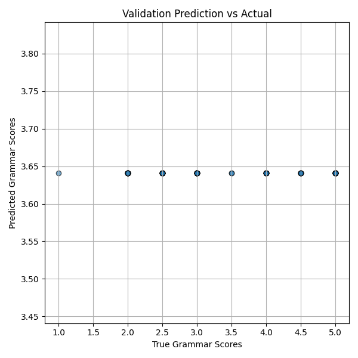

# 🧠 Grammar Score Predictor for Spoken Audio

A Machine Learning project to **predict grammar scores** from spoken audio using deep learning and natural language processing. This project involves preprocessing audio files, extracting features, training a regression model, and visualizing prediction performance.

---

## 📊 Sample Result

<p align="center">
  
</p>

**Insight**: As seen above, the model predicts grammar scores fairly consistently across various true values — indicating a bias in output (potential improvement point!).

---

## 📁 Project Overview

- 🎧 **Audio Preprocessing**: Feature extraction from `.wav` files using `librosa` and `torchaudio`.
- 🔍 **Feature Engineering**: Use of spectral features and embeddings for model training.
- 🧠 **Model Training**: Regression model built with `PyTorch` to predict grammar scores.
- 📈 **Evaluation**: Scatter plots and scoring metrics for validation.
- 📦 **Submission**: CSV output aligned with competition-style format.

---

## 🚀 Getting Started

### 1. Clone the Repository
```bash
git clone https://github.com/your-username/grammar-score-predictor.git
cd grammar-score-predictor

